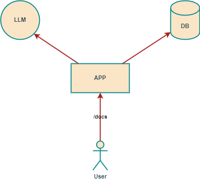

# Построение графа знаний


Проект предназначен для построения графа знаний из текста при помощи локальной LLM.

В проекте используется open source проект [Tabby](https://github.com/TabbyML/tabby), который запускает API для обращения к квантованным LLM в формате GGUF.

> По умолчанию Tabby использует GPU, поэтому рекомендуется запускать на устройствах с VRAM от **8Gb** с поддержкой CUDA.

Основное решение в виде документированного API (swagger). 

## Запуск

```
docker-compose up -d
```

> При запуске Tabby загружает и проверяет hash языковых моделей. Общий объем моделей ~**5.5Gb**, поэтому запуск сопровождается с некоторой задержкой.

Для работы языковой модели Tabby, необходимо зарегистрироваться в web-интерфейсе (по умолчанию http://localhost:8080/), а потом взять Token.
Создайте `.env` и поместите туда переменную окружения `tabby_key`. 

По итогу `.env` содержит:

```
tabby_key=auth_...
```

> После внесения правок в `.env` следует перезапустить `docker-compose up -d`.

## Тесты 

- Для проведения тестов нужен `python => 3.10` с библиотекой `requests`.
- Для запуска тестов, добавьте переменную `test_api` с адресом тестируемого API, по умолчанию `http://localhost:9000/api`.

> Проверти версию `python` и наличие библиотеки `requests`:

```
python -V
> 3.10

python -m pip freeze | grep requests
> requests==2.32.3
```

В случае отсутствия установите библиотеку `requests`:

```
python -m pip install requests
```

**Запуск тестов**

```
# в PowerShell
$env:TEST_API="http://localhost:9000/api"; python -m unittest discover -s tests -v 

# в Linux/macOS
TEST_API=http://localhost:9000/api python -m unittest discover -s tests -v    
или
export TEST_API=http://localhost:9000/api && python3 -m unittest discover -s tests -v

# в cmd     
set TEST_API=http://localhost:9000/api
python -m unittest discover -s tests -v  
```

> Замените `python` на подходящую версию (python3 или python3.10)

## Основные компоненты



1. Основное приложение на Python (FastAPI).
2. Tabby-сервис с локальной большой языковой моделью.
3. Графовая база данных Neo4j.
