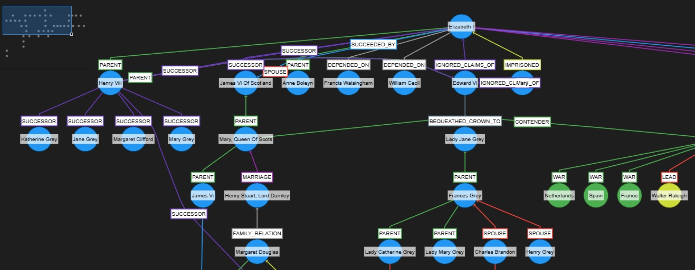

# Граф знаний

Граф знаний - это модель представления информации в виде ориентированного мультисущностного графа, состоящего из узлов (сущностей) и ребер (отношений) между ними. Каждое ребро отражает определённое отношение между двумя сущностями, образуя тройки вида (субъект, отношение, объект), которые называются фактами.

Для автоматического выявления из текста триплетов (субъект, отношение, объект) применяется [языковая модель](llm.md).

LLM способна выявлять отношения разного залога, поэтому в проекте выявляются именно активно залога по отношению к человеку или от частного к общему (агент, действие, объект).

